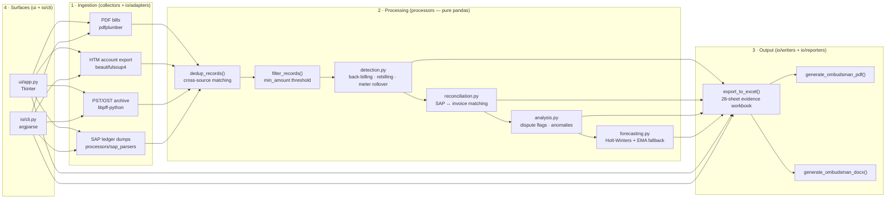

# Architecture

This document describes the post-modularization structure of the EDF Bill Fetcher codebase. The codebase was refactored from a single 10,645-line `edf_collector.py` monolith into the `edf_bill_fetcher/` hexagonal package (tag `modularization-complete`).

## Top-level layout

```
edf-bill-fetcher/
├── edf_bill_fetcher/         # The package (canonical home for all production code)
│   ├── collectors/           # framework boundary — engine orchestrator
│   ├── processors/           # stdlib + pandas — business logic
│   ├── io/
│   │   ├── writers/          # openpyxl — Excel sheet builders (one per sheet)
│   │   ├── reporters/        # reportlab + docx — PDF + DOCX report renderers
│   │   ├── adapters/         # libpff-python — PST/OST archive adapter
│   │   ├── cli.py            # argv parsing + CLI entrypoints
│   ├── helpers/              # pure stdlib — date math, formatting, excel helpers, theme, package version
│   ├── models/               # typed domain contracts — dataclasses (events) + ConfigDict TypedDict
│   ├── ui/                   # tkinter — GUI (App, ReportOptionsDialog)
│   └── writers/__init__.py   # facade re-exporting writers._helpers analysis helpers
├── main.py                   # Console-script entrypoint: one-line re-export of io.cli.main
├── tests/                    # Test suite (1300+ tests)
└── docs/                     # This directory
```

## Data flow

The pipeline runs in four stages. Ingestion pulls raw records from each source; processing deduplicates, filters and derives dispute evidence; output renders the evidence workbook and the ombudsman report; the GUI/CLI surfaces drive the whole flow.



## Hexagonal layering

The package enforces a strict hexagonal dependency direction. Outer layers may import from inner layers; inner layers MUST NOT import from outer layers.

```
        ┌─────────────────────┐
        │      ui/            │ tkinter (outermost)
        ├─────────────────────┤
        │   io/               │ framework adapters (openpyxl, reportlab, docx, libpff-python, pickle)
        │   ├── writers/      │
        │   ├── reporters/    │
        │   ├── adapters/     │
        │   └── cli.py        │
        ├─────────────────────┤
        │   collectors/       │ framework boundary (pdfplumber, bs4)
        ├─────────────────────┤
        │   processors/       │ business logic (stdlib + pandas only — NO framework imports at module scope)
        ├─────────────────────┤
        │   helpers/          │ pure stdlib (NO third-party imports)
        ├─────────────────────┤
        │   models/           │ dataclasses + stdlib
        └─────────────────────┘
```

**Enforcement rules:**

| Layer              | Allowed imports                                  | Forbidden imports                              |
| ------------------ | ------------------------------------------------ | ---------------------------------------------- |
| `helpers/`         | stdlib only                                      | any third-party, any other layer               |
| `models/`          | stdlib + dataclasses                             | any third-party, any other layer               |
| `processors/`      | stdlib + pandas + sibling processors + helpers + models | third-party frameworks (openpyxl, reportlab, pdfplumber, libpff-python) |
| `collectors/`      | stdlib + pandas + pdfplumber + bs4 + processors + helpers | tkinter, openpyxl, reportlab            |
| `io/writers/`      | openpyxl + pandas + writers._helpers + helpers + processors | tkinter                                  |
| `io/reporters/`    | reportlab + docx + openpyxl + pandas + writers._helpers + helpers + processors | tkinter                       |
| `io/adapters/`     | third-party (libpff-python) + helpers             | anything else                                    |
| `io/cli.py`        | stdlib (argparse, pickle, importlib) + collectors + io.writers.export + io.reporters | tkinter                  |
| `ui/`              | tkinter + collectors + io.writers.export + io.reporters + processors + helpers |                  |

The `processors/` no-framework-import rule is the load-bearing constraint. It keeps business logic (dedup, pattern detection, reconciliation, forecasting) unit-testable with synthetic DataFrames — no Excel/PDF/tkinter required.

## Public import API

The package exposes writer entry points through `edf_bill_fetcher.io.writers` — both flat (aggregated in `io/writers/__init__.py`'s `__all__`) and submodule-scoped:

| Style                | Example                                                          | Use when                                     |
| -------------------- | ---------------------------------------------------------------- | -------------------------------------------- |
| **Flat-canonical**   | `from edf_bill_fetcher.io.writers import export_to_excel`        | Common case — short path                     |
| **Submodule-scoped** | `from edf_bill_fetcher.io.writers.export import export_to_excel` | Code that wants to be dependency-explicit    |

`edf_bill_fetcher.io.writers/__init__.py` eagerly re-exports all writer function names in `__all__`; the implementations live in the per-sheet submodules. The top-level `edf_collector.py` / `edf_report*.py` compat modules and the temporary PEP 562 lazy-shim layers were removed after consumers migrated — no backward-compat shims remain.

## The `EvidenceEngine` — ingestion surface

`edf_bill_fetcher.collectors.engine.EvidenceEngine` is the central orchestrator. It exposes symmetric per-source processing methods:

| Method                       | Source            | Required dep           |
| ---------------------------- | ----------------- | ---------------------- |
| `process_pdf_file(path, …)`  | local PDF bills   | pdfplumber             |
| `process_htm_file(path, …)`  | HTM account export | beautifulsoup4         |
| `process_pst_file(path)`     | PST/OST archive   | libpff-python (core dependency; engine still guards `HAS_PYPFF` and logs + skips if the import fails) |

Each method appends to `engine.records` (a `list[dict]`). After ingestion, `dedup_records()` de-duplicates cross-source. `filter_records(min_amount)` applies the threshold filter. The engine carries its own `error_log: list[str]` for soft failures.

## Writers — Excel sheet builders

Each Excel sheet has its own function in `io/writers/<sheet_name>.py`:

| File                               | Builds                                                              |
| ---------------------------------- | ------------------------------------------------------------------ |
| `evidence.py`                       | `EDF Evidence Report` + `Annual Summary` + `Duplicate Entries`     |
| `statistical.py`                   | `Statistical Analysis` + `Balance Trend` + `Year-on-Year` sheets   |
| `payment.py`                       | `Payment Analysis` sheet                                            |
| `forecast.py`                      | `Forecast & Projection` sheet                                       |
| `data_quality.py`                  | `Data Quality Report` sheet                                          |
| `tariff.py`                        | `Tariff Analysis` sheet                                            |
| `back_billing.py`                 | `Back-billing Analysis` sheet                                       |
| `rebilling.py`                    | `Rebilling & Corrections` sheet                                    |
| `meter.py`                        | `Meter Readings` + `Contract History` sheets                       |
| `reconciliation.py`              | `Reconciliation` sheet + `_recon_parse_iso_date` / `_recon_amount_to_float` helpers |
| `sap.py`                          | All five SAP sheets (Contract History, Meter Readings, Financial Transactions, Back-billing Events, ↔ EDF Matched Events) |
| `export.py`                       | `export_to_excel` — the large orchestrator (~1,500 lines) that calls each writer to render a sheet into the workbook |
| `analysis.py`                     | `run_analysers` — one-shot dispatcher that returns `{back_billing, rebilling, meter_rollover, contracts}` |
| `export.py`                       | `export_to_excel` — the orchestrator that calls each writer, plus the `Provenance` sheet (tool version, config snapshot, generation timestamp) opened first |

`export_to_excel` (~1,500 lines) is the largest single function in the codebase. It's the orchestrator: it wires every writer into the output workbook in the correct sheet order with the correct conditional-emission gating. It intentionally sits in `io/writers/` (the openpyxl layer), not in `processors/`, because its job is purely I/O orchestration — never business logic. Its closures were lifted to module scope in Wave 5c (the file now opens with six module-level helpers — `_compute_unit_rate`, `_summary`, `ks_row`, `pc_stat`, `_banner`, `_write_provenance_sheet`).

## Reporters — PDF + DOCX renderers

Two parallel renderers share a single section registry:

- `io/reporters/pdf_report.py` — `generate_pdf_from_gui` + `generate_ombudsman_pdf` (reportlab-based)
- `io/reporters/docx_report.py` — `generate_docx_from_gui` + `generate_ombudsman_docx` (python-docx-based)

The registry `REPORT_SECTIONS` lives in `pdf_report.py`; the DOCX reporter imports it. A structural parity test (`tests/test_dispatch_parity.py`) locks the invariant that the registry, the PDF dispatcher's `section_builders`, and the DOCX dispatcher's `section_builders` all expose exactly the same set of keys.

## Processors — pure business logic

Located in `edf_bill_fetcher.processors`:

| Module             | Public surface                                                                     |
| ------------------ | ---------------------------------------------------------------------------------- |
| `detection.py`     | `detect_back_billing`, `detect_rebilling`, `detect_meter_rollover`, `extract_*_statement_rows` |
| `matching.py`      | `infer_contracts`, `account_number_matches`, source-precedence helpers              |
| `reconciliation.py` | `detect_reconciliation_statement`, cross-source reconciliation matcher             |
| `analysis.py`      | `compute_dispute_flags`, period-anomaly labeling, reversal matching                 |
| `patterns.py`      | `AMOUNT_PATTERNS`, `READING_PATTERNS`, regex pattern banks                           |
| `extraction.py`    | `extract_*` field-extraction functions used by `collectors/engine.py`               |
| `forecasting.py`   | Holt-Winters + linear+EMA fallback forecasting (statsmodels-guarded)               |
| `sap_parsers.py`   | Multi-regex SAP PDF parser (Contract History, Meter Readings, Financial Transactions) |

Processors receive DataFrames as function arguments — they do not pull data from any module-scope state. This is what makes them unit-testable with synthetic input.

## Module map

Every production file in `edf_bill_fetcher/`, one line each. This is the fastest way to find where a given concern lives.

| File | Responsibility |
| ---- | -------------- |
| `main.py` | Console-script entrypoint — re-exports `io.cli.main` |
| `collectors/engine.py` | `EvidenceEngine` — the ingestion orchestrator: PDF/HTM/PST/SAP dispatch, `records`, `error_log`, dedup + filter |
| `io/cli.py` | argparse parsing + CLI entrypoints (run / report / export) |
| `io/writers/export.py` | `export_to_excel` orchestrator + `Provenance` sheet |
| `io/writers/evidence.py` | `EDF Evidence Report` + `Annual Summary` + `Duplicate Entries` sheets |
| `io/writers/statistical.py` | `Statistical Analysis` + `Balance Trend` + `Year-on-Year` |
| `io/writers/payment.py` | `Payment Analysis` |
| `io/writers/forecast.py` | `Forecast & Projection` |
| `io/writers/data_quality.py` | `Data Quality Report` |
| `io/writers/tariff.py` | `Tariff Analysis` |
| `io/writers/back_billing.py` | `Back-billing Analysis` |
| `io/writers/rebilling.py` | `Rebilling & Corrections` |
| `io/writers/meter.py` | `Meter Readings` + `Contract History` |
| `io/writers/reconciliation.py` | `Reconciliation` sheet + ISO-date / amount parsers |
| `io/writers/sap.py` | All five SAP sheets + EDF↔SAP matched events |
| `io/writers/analysis.py` | `run_analysers` one-shot dispatcher (`back_billing`, `rebilling`, `meter_rollover`, `contracts`) |
| `io/writers/_helpers.py` | Shared writer helpers (`match_sap_events_to_edf`, `detect_sap_back_billing_events`, dispute-flag mirror) |
| `io/reporters/pdf_report.py` | reportlab renderer + `REPORT_SECTIONS` registry + `_get_package_version` |
| `io/reporters/docx_report.py` | python-docx renderer sharing the section registry |
| `io/adapters/pdf.py` | PDF text extraction (pdfplumber) |
| `io/adapters/html.py` | HTM account-history extraction (beautifulsoup4) |
| `io/adapters/pst.py` | PST/OST archive extraction (libpff-python) |
| `processors/detection.py` | Back-billing / rebilling / meter-rollover detection + statement-row extraction |
| `processors/matching.py` | `infer_contracts`, `account_number_matches`, dedup scoring |
| `processors/reconciliation.py` | SAP↔invoice reconciliation matcher |
| `processors/analysis.py` | `compute_dispute_flags`, period-anomaly labeling, reversal matching |
| `processors/patterns.py` | `AMOUNT_PATTERNS`, `READING_PATTERNS` regex banks |
| `processors/extraction.py` | Field extraction used by the engine |
| `processors/forecasting.py` | Holt-Winters + linear/EMA fallback (statsmodels-guarded) |
| `processors/sap_parsers.py` | Multi-regex SAP PDF parser |
| `helpers/date_utils.py` | Date parsing / sort-date conversion |
| `helpers/formatting.py` | Money / number / percent formatting |
| `helpers/excel_utils.py` | Cell/text/header styling helpers for writers |
| `helpers/pdf_utils.py` | Shared PDF helpers |
| `helpers/theme.py` | Workbook colour palette |
| `helpers/version.py` | `get_package_version` — repo-root pyproject version (single source of truth) |
| `models/events.py` | Domain dataclasses (`SapBackBillingEvent`, etc.) |
| `models/config.py` | `ConfigDict` — the typed configuration contract (all 20 canonical keys) |
| `models/report_models.py` | Six shared analysis models (`DataQualityReport`, `StatisticalAnalysis`, `ForecastResult`, `OfgemComparison`, `TariffAnalysis`, `DisputeAnalysis`) computed once and consumed by the Excel + PDF + DOCX + HTML surfaces |
| `ui/app.py` | Tkinter GUI + `ReportOptionsDialog` + config persistence |
| `writers/__init__.py` | Facade re-exporting `_helpers` analysis helpers (plan-exempt leaf) |

## Legacy compatibility layer — removed

The repo-root modules `edf_collector.py`, `edf_report.py`, and `edf_report_docx.py` were deleted in the modularization (commit `b7a185d`, Option A — no compat shims). Scripts that imported `from edf_collector import …` must migrate to the `edf_bill_fetcher.*` package paths; the temporary PEP 562 re-export layers that bridged the migration were likewise removed once consumers migrated.

## CI gate

CI (`.github/workflows/ci.yml`) runs on Python 3.10 / 3.11 / 3.12 × ubuntu / windows / macos. The four gates:

1. `ruff check .` — PEP 8 + PEP 257 + import ordering (see `pyproject.toml [tool.ruff]` for the rule selection; the full D-rule docstring set is enforced)
2. `ruff format --check .` — formatting
3. `mypy .` — strict type check (`check_untyped_defs = true`, `disallow_incomplete_defs = true`); the 12 pre-existing drift errors in 5 test files were annotated as mypy-2.x–compatible, and `scratch/` (untracked, absent in CI) is the only thing a plain `mypy .` flags locally
4. `xvfb-run -a pytest --cov=. --cov-report=xml` — full test suite under coverage (auto-activates `pytest-xvfb` on headless Linux for tkinter tests), with `fail_under = 90` enforced by pytest-cov

A release is one CI green away from shippable.
